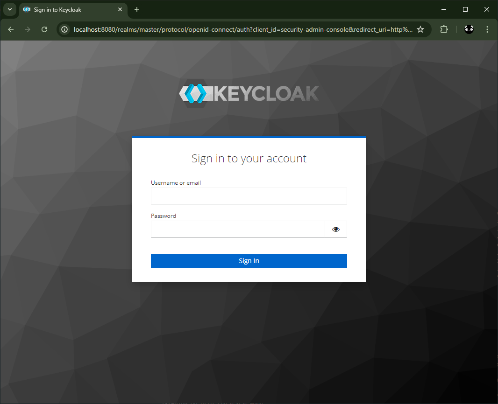

# docker_keycloak_example1

## 概要
とりあえず Keycloak を起動してみる。

Keycloak キークローク    
https://www.keycloak.org/  

Keycloakとは？  
https://www.hitachi.co.jp/products/it/oss/efforts/keycloak/index.html  
* ID 管理やアクセス管理を実現する OSS
* 各種サービスにログイン機能やシングルサインオン(SSO)を導入
* システムやサービスをつなぐ API のセキュリティ確保に活用
* 2023/4 に CNCF のプロジェクトに追加

Keycloak / Guides / Getting started / Docker  
https://www.keycloak.org/getting-started/getting-started-docker  

## 起動
```
docker compose up
```
http://localhost:8080

  

  

※ Chrome の翻訳機能  


## 参考
* 【実例】Keycloak(Quarkus distro)+PostgreSQLをDockerComposeで動かす【サンプルコード付き】  
  https://zenn.dev/issy/articles/keycloak-docker-compose  

## メモ

### ERROR: hostname is not configured
エラー：ホスト名が設定されていない  
hostname-strict: リクエストヘッダーからホスト名を動的に解決しない (デフォルト:true)  
セキュリティのためデフォルトでは true になっており、そのためホスト名の設定が必須になっている。  
ホスト名を設定するか、動的解決を有効にする。

```
keycloak-1  | ERROR: Unexpected error when starting the server in (production) mode
keycloak-1  | ERROR: Failed to start quarkus
keycloak-1  | ERROR: hostname is not configured; either configure hostname, or set hostname-strict to false
keycloak-1  | For more details run the same command passing the '--verbose' option. Also you can use '--help' to see the details about the usage of the particular command.
keycloak-1 exited with code 1
```

### ERROR:  relation "migration_model" does not exist

正常動作  
Keycloak が初回起動時にスキーマの存在チェックをした時に記録されるログ 

[ERROR: relation "migration_model" does not exist
#10235](https://github.com/keycloak/keycloak/issues/10235)  

```
keycloak-1  | 2024-07-27 08:24:28,188 INFO  [org.jgroups.protocols.FD_SOCK2] (Thread-5) server listening on *.41027
postgres-1  | 2024-07-26 23:24:28.835 UTC [184] ERROR:  relation "migration_model" does not exist at character 25
postgres-1  | 2024-07-26 23:24:28.835 UTC [184] STATEMENT:  SELECT ID, VERSION FROM MIGRATION_MODEL ORDER BY UPDATE_TIME DESC
keycloak-1  | 2024-07-27 08:24:30,214 INFO  [org.jgroups.protocols.pbcast.GMS] (Thread-5) 95b4ba75f648-22296: no members discovered after 2006 ms: creating cluster as coordinator
keycloak-1  | 2024-07-27 08:24:30,265 INFO  [org.infinispan.CLUSTER] (Thread-5) ISPN000094: Received new cluster view for channel ISPN: [95b4ba75f648-22296|0] (1) [95b4ba75f648-22296]
postgres-1  | 2024-07-26 23:24:30.313 UTC [184] ERROR:  relation "public.databasechangelog" does not exist at character 22
postgres-1  | 2024-07-26 23:24:30.313 UTC [184] STATEMENT:  SELECT COUNT(*) FROM public.databasechangelog
keycloak-1  | 2024-07-27 08:24:30,453 INFO  [org.infinispan.CLUSTER] (Thread-5) ISPN000079: Channel `ISPN` local address is `95b4ba75f648-22296`, physical addresses are `[172.21.0.3:56563]`
postgres-1  | 2024-07-26 23:24:31.251 UTC [201] ERROR:  relation "public.databasechangeloglock" does not exist at character 22
postgres-1  | 2024-07-26 23:24:31.251 UTC [201] STATEMENT:  SELECT COUNT(*) FROM public.databasechangeloglock
postgres-1  | 2024-07-26 23:24:31.348 UTC [184] ERROR:  relation "public.databasechangelog" does not exist at character 22
postgres-1  | 2024-07-26 23:24:31.348 UTC [184] STATEMENT:  SELECT COUNT(*) FROM public.databasechangelog
keycloak-1  | 2024-07-27 08:24:31,355 INFO  [org.keycloak.quarkus.runtime.storage.legacy.liquibase.QuarkusJpaUpdaterProvider] (main) Initializing database schema. Using changelog META-INF/jpa-changelog-master.xml
```